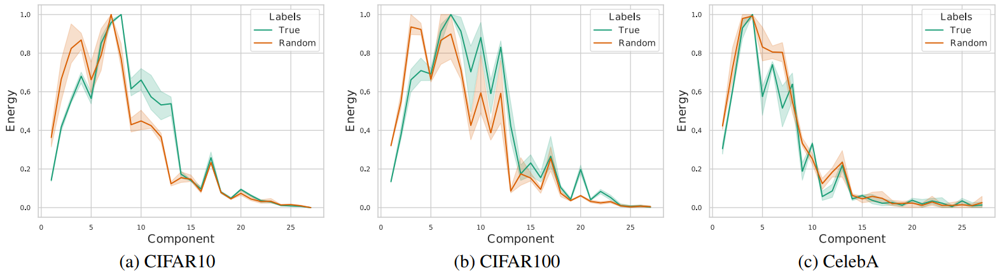
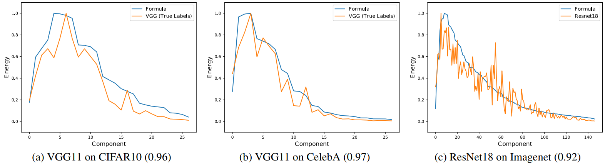

# What do CNNs Learn in the First Layer and Why? A Linear Systems Perspective

This repository is the official implementation of of our paper ["What do CNNs Learn in the First Layer and Why? A Linear Systems Perspective"](https://arxiv.org/abs/2206.02454), by Rhea Chowers and Yair Weiss, which has been accepted to ICML 2023.



<p align="center" style="text-align: center;">VGG trained with true and random labels learn similar energy profiles in their first layer.</p>

# Summary
In this paper, we adopt the linear systems perspective and consider the first layer as a filter bank and measure the sensitivity of the bank to different spatial
frequencies, calculated using PCA of image patches. We name the profiles of sensitivities the **"energy profile"** and use it to compute the correlation between the first layers learnt by different models and in various settings.

We show that trained networks learn consistent representations that are far from their initialization despite the fact that CNNs with commonly used architectures can be trained with **fixed, random filters** in the first layer and still yield comparable performance to full learning. We also show that the same energy profile is obtained when the network is trained to predict **random labels**. We then show that under realistic assumptions on the statistics of the input and labels, consistency also occurs in simple, linear CNNs, and derive an analytical form for its energy profile. We show that as the number of iterations goes to infinity, this profile takes the form of a first layer that performs whitening of the input image patches. Finally, we show that the analytical formula which we derived for linear CNNs gives an excellent fit to the energy profile of real-world CNNs as well, when trained with either **true or random labels**.


<p align="center" style="text-align: center;">Examples of fitting the formula to different networks trained on different datasets (correlation in parenthesis). Overall, the formula captures the trend learned in the first layer of the networks.</p>


# Citation
```
@misc{chowers2023cnns,
      title={What do CNNs Learn in the First Layer and Why? A Linear Systems Perspective}, 
      author={Rhea Chowers and Yair Weiss},
      year={2023},
      eprint={2206.02454},
      archivePrefix={arXiv},
      primaryClass={cs.CV}
}

```
